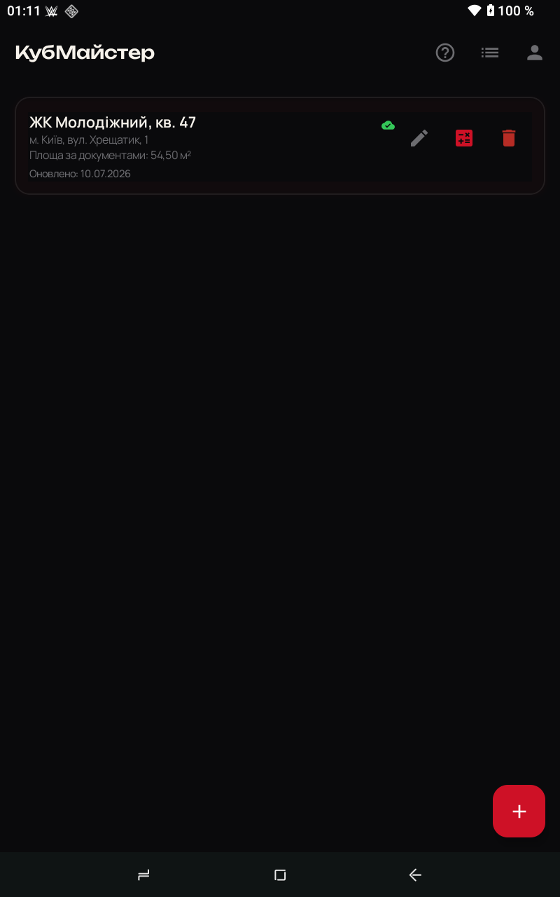
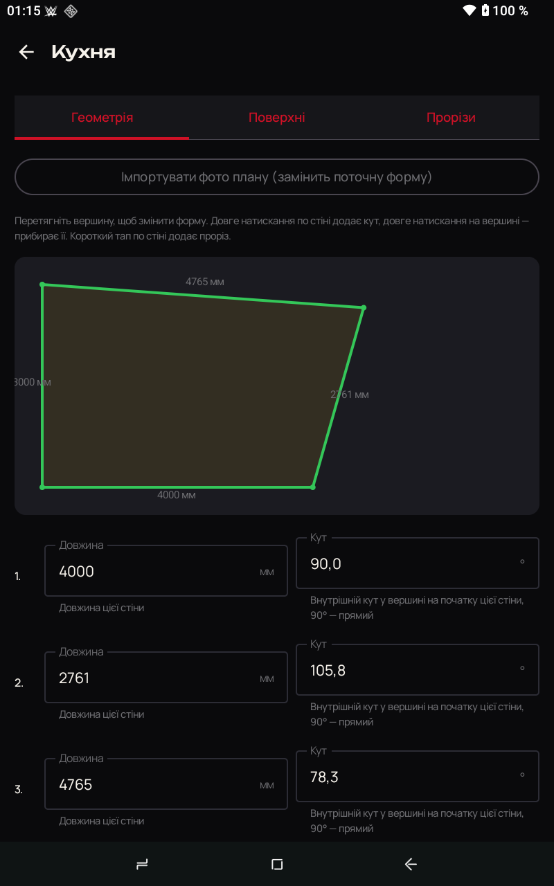
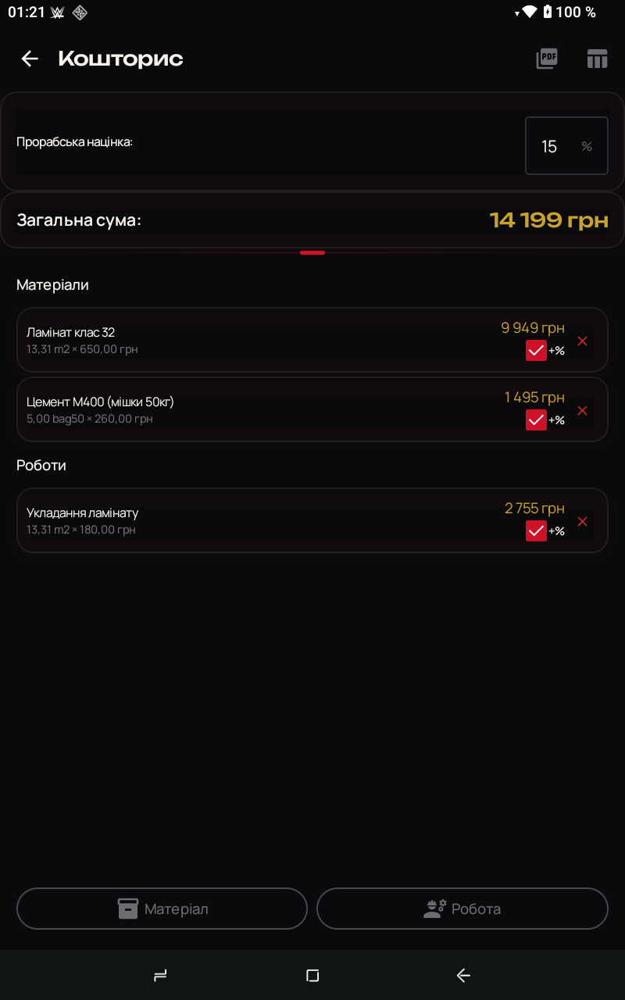
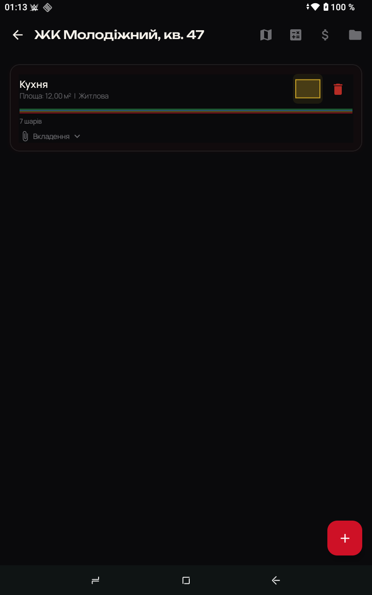
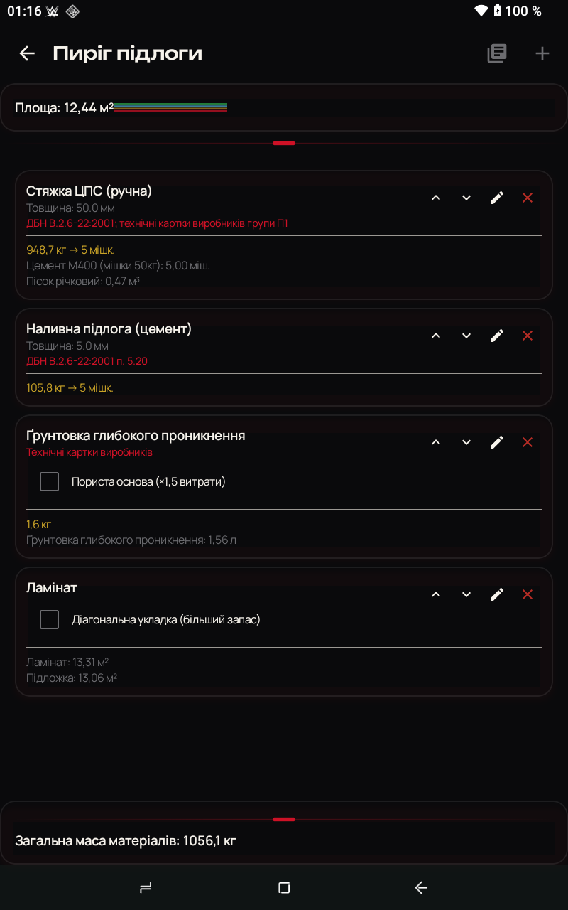
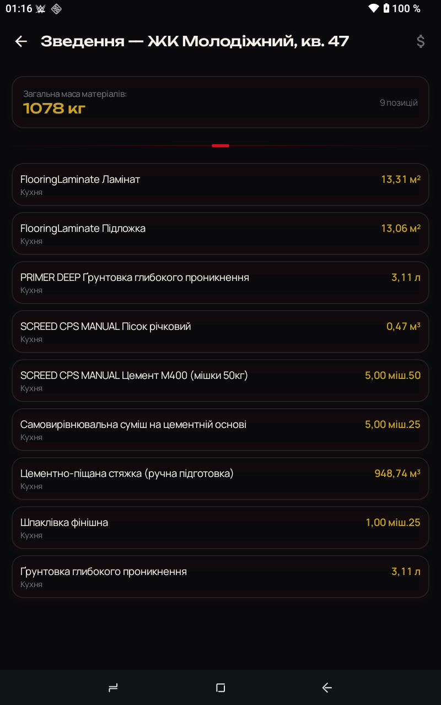
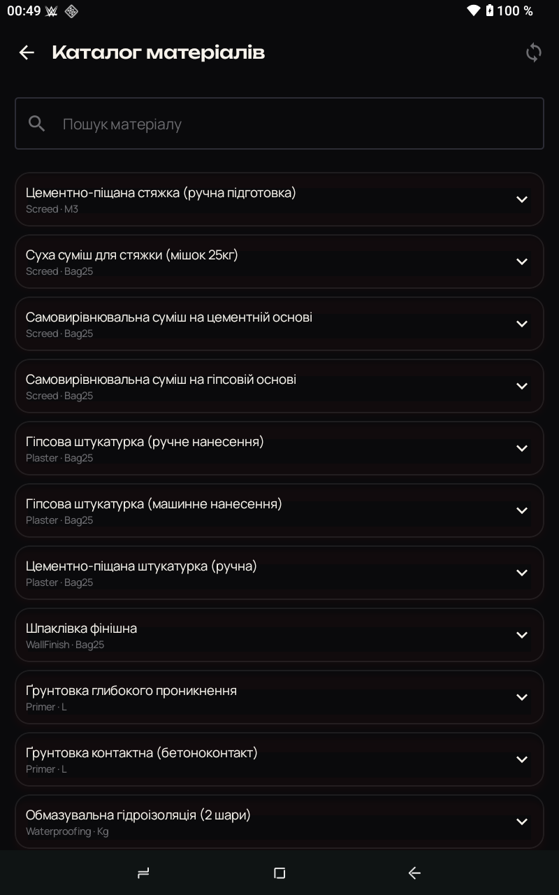
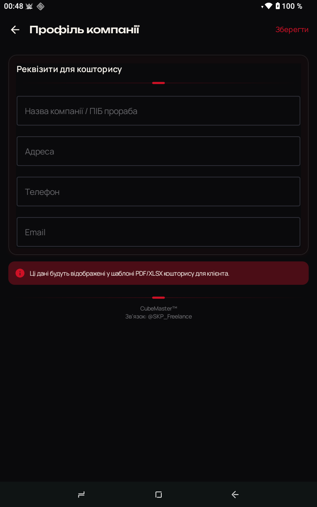
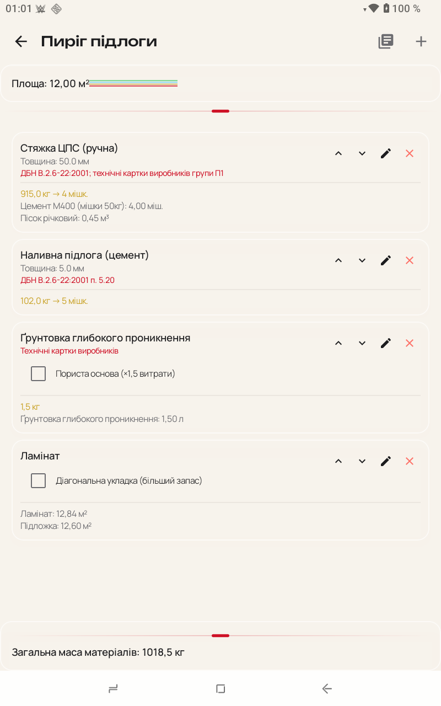

# КубМайстер (CubeMaster)

Мобільний калькулятор для будівельників і прорабів: рахує кубатуру та витрату матеріалів для ремонту на основі реальної форми приміщення, а не приблизних прикидок "на око". Працює повністю офлайн, синхронізується між пристроями, коли є інтернет.

<p align="center">
  
  
  
</p>

## Зміст

- [Що це таке](#що-це-таке)
- [Скріншоти](#скріншоти)
- [Технології та чому саме вони](#технології-та-чому-саме-вони)
- [Встановлення — крок за кроком](#встановлення--крок-за-кроком)
- [Команди розробки](#команди-розробки)
- [Структура репозиторію](#структура-репозиторію)
- [Ключові правила розрахунку](#ключові-правила-розрахунку)
- [Хмарна частина (Firebase)](#хмарна-частина-firebase)
- [Автор](#автор)

## Що це таке

Прораб чи будівельник створює проєкт (об'єкт ремонту), додає кімнати, малює їхню реальну форму (не обов'язково прямокутник — застосунок підтримує будь-який багатокутник), обирає з чого складається "пиріг" підлоги/стелі/стін (стяжка, ґрунтовка, фінішне покриття тощо), і отримує:

- точну площу і периметр кожної кімнати з урахуванням реальної геометрії;
- список матеріалів і їх кількість, розраховані за нормами ДБН/ДСТУ (не "приблизно", а з посиланням на конкретний пункт документа);
- кошторис у гривнях з можливістю додати прорабську націнку та експортувати в PDF/XLSX для клієнта;
- автоматичні попередження там, де помилка коштує дорого — наприклад, застосунок не дасть забути про гідроізоляцію у вологому приміщенні чи зберегти форму кімнати, стіни якої перетинаються самі із собою.

Інтерфейс — повністю українською, розрахунок — офлайн (немає інтернету на об'єкті — це нормально, дані синхронізуються пізніше).

## Скріншоти

| Проєкти | Кімнати проєкту | Форма кімнати |
|---|---|---|
|  |  |  |

| Пиріг підлоги | Зведення матеріалів | Кошторис |
|---|---|---|
|  |  |  |

| Каталог матеріалів | Профіль компанії | Світла тема |
|---|---|---|
|  |  |  |

## Технології та чому саме вони

Кожен нетривіальний вибір нижче — свідоме рішення, а не "за замовчуванням". Пояснюємо, що це і чому не альтернатива.

### Мова і UI-фреймворк: Kotlin + Jetpack Compose, не Flutter/React Native

**Що це:** Compose — це спосіб описувати екран Android кодом (Kotlin-функціями), а не окремими XML-файлами розмітки, як робили раніше. Flutter/React Native — крос-платформні фреймворки: один код одразу для Android і iOS.

**Чому не крос-платформа:** застосунок орієнтований виключно на Android (будівельники в Україні майже завжди на Android-пристроях, часто не найновіших і не найпотужніших). Крос-платформний рушій — це завжди додатковий шар між кодом і залізом, тобто повільніше на слабких пристроях і більший розмір застосунку. Native Kotlin/Compose важить менше і швидше рахує геометрію прямо на пристрої без інтернету.

**Якби обрали Flutter/React Native:** отримали б безкоштовну iOS-версію в майбутньому, але заплатили б повільнішим офлайн-розрахунком на бюджетних телефонах — а це саме той сценарій, для якого застосунок і робиться.

### Локальне сховище: Room (SQLite), а не тільки Firebase

**Що це:** Room — бібліотека для роботи з SQLite (файлова база даних прямо на телефоні). Firebase Firestore — хмарна база в інтернеті.

**Чому не тільки хмара:** на будівельному об'єкті інтернету часто немає або він нестабільний. Room — джерело істини на пристрої: застосунок повністю працює без мережі, а WorkManager (окрема бібліотека для фонових задач) синхронізує дані з Firestore, коли з'являється зв'язок.

**Якби покладались тільки на Firestore:** без інтернету застосунок би просто не відкрився або показував порожні екрани — неприйнятно для сценарію "прораб на об'єкті без Wi-Fi".

### Обчислювальне ядро окремим модулем (`cubemaster-core`)

**Що це:** весь код геометрії (площа багатокутника, перевірка самоперетину, розрахунок витрати матеріалів) винесено в окремий Kotlin-модуль без жодної залежності від Android.

**Чому:** такий код можна покрити швидкими unit-тестами, які виконуються за секунди без емулятора, і теоретично підключити цей самий модуль до майбутньої desktop- чи CLI-версії без переписування.

### Дизайн: власна система "скла" на базі Haze, а не Material 3 "з коробки"

**Що це:** Material 3 — стандартна дизайн-система Google. Haze ([dev.chrisbanes.haze](https://github.com/chrisbanes/haze)) — бібліотека, що додає справжнє розмиття фону (backdrop blur) під напівпрозорими картками — той самий ефект, що в iOS Control Center.

**Чому не Material 3 "з коробки":** типовий Material 3 виглядає однаково в тисячах застосунків і не передає "технологічність", яку хотілося застосунку для інженерних розрахунків. Material 3 залишили лише як інфраструктуру (доступність, базові компоненти), а візуально наклали власну темну OLED-палітру (глибокий чорний — довше живе батарея на AMOLED-екранах) з акцентним червоно-золотим брендом.

**Чому Haze, а не просто напівпрозорий колір:** без Haze "скло" — це просто плоский колір з прозорістю, немає ефекту розмиття того, що позаду. Це коштує підтримки Android 12+ (`minSdk 31`) — свідома жертва: пристрої на Android 10-11 більше не підтримуються, натомість весь застосунок виглядає однаково преміально на всіх сучасних пристроях, без "урізаної" версії дизайну для старих версій ОС.

### Порівняння підходів до зберігання й синхронізації

| Підхід | Офлайн-робота | Мультипристроєвість | Складність |
|---|---|---|---|
| Тільки Firestore | Немає (потрібен інтернет) | Легка (з коробки) | Низька |
| Тільки Room (без хмари) | Повна | Немає | Низька |
| **Room + Firestore + WorkManager (обрано)** | Повна | Є, з відкладеною синхронізацією | Вища, але виправдана сценарієм використання |

## Встановлення — крок за кроком

Інструкція розрахована на те, що на комп'ютері ще нічого з цього не встановлено.

### Крок 1. Встановити Java Development Kit (JDK) 17

Android-застосунки збираються інструментом Gradle, а Gradle працює на Java. Без JDK нічого з наступних кроків не запрацює.

- **Windows:** завантажити [Eclipse Temurin JDK 17](https://adoptium.net/temurin/releases/?version=17), запустити встановлювач, залишити всі параметри за замовчуванням.
- **macOS:** `brew install openjdk@17` (потрібен [Homebrew](https://brew.sh) — якщо його немає, спочатку встановити за інструкцією на сайті).
- **Linux (Ubuntu/Debian):** `sudo apt install openjdk-17-jdk`

Перевірити, що встановилось:

```bash
java -version
```

**Що має статись:** термінал виведе рядок з `17` у версії (наприклад, `openjdk version "17.0.x"`). Якщо команда не знайдена — перезапустіть термінал (змінні середовища оновлюються не миттєво) або перевстановіть JDK.

### Крок 2. Встановити Android Studio

Android Studio — це редактор коду з усім необхідним для збірки Android-застосунків (Android SDK, емулятор, інструменти діагностики) в одному пакеті.

1. Завантажити з [developer.android.com/studio](https://developer.android.com/studio) — версія під вашу ОС визначиться автоматично.
2. Запустити встановлювач, на кроці "Install Type" обрати **Standard** (він сам підтягне Android SDK потрібної версії).
3. Дочекатись завершення завантаження компонентів (може тривати 10-20 хвилин залежно від швидкості інтернету — завантажується кілька гігабайт).

### Крок 3. Клонувати репозиторій

```bash
git clone https://github.com/SKPdeveloper/CubeMaster.git
cd CubeMaster
```

**Якщо Git не встановлено:** Windows — завантажити з [git-scm.com](https://git-scm.com/downloads); macOS — `brew install git` або погодитись на встановлення Xcode Command Line Tools, коли система запропонує; Linux — `sudo apt install git`.

### Крок 4. Відкрити проєкт в Android Studio

1. Android Studio → **Open** → обрати папку `CubeMaster`, яку щойно клонували.
2. Дочекатись завершення синхронізації Gradle (смужка прогресу знизу справа, підпис "Gradle sync"). Перший раз може тривати кілька хвилин — завантажуються залежності.

**Якщо синхронізація впала з помилкою:** найчастіша причина — немає файлу `google-services.json` (наступний крок). Помилка виглядатиме як `File google-services.json is missing`.

### Крок 5. Налаштувати Firebase (google-services.json)

Застосунок використовує Firebase для хмарної синхронізації, авторизації та зберігання фото. Без конфігураційного файлу застосунок не збереться.

1. Створити проєкт на [console.firebase.google.com](https://console.firebase.google.com) (безкоштовно).
2. У налаштуваннях проєкту (шестерня зверху ліворуч → **Project settings**) → вкладка **General** → розділ **Your apps** → **Add app** → обрати іконку Android.
3. Package name вказати **`com.example.cubemaster`** (це поточний ідентифікатор застосунку — подивитись/змінити можна в `app/build.gradle.kts`, поле `applicationId`).
4. Завантажити файл, який запропонує Firebase (`google-services.json`), і покласти його в `app/google-services.json` (саме в цю папку, поряд з `build.gradle.kts` модуля `app`).
5. У Firebase Console увімкнути: **Authentication** (Email/Password), **Firestore Database**, **Storage**, **Cloud Messaging**. Кожен пункт — окрема вкладка в лівому меню консолі, увімкнення відбувається кнопкою "Get started" на першому відкритті вкладки.

Детальніша інструкція для деплою правил безпеки та Cloud Functions — окремий документ [`FIREBASE_SETUP.md`](FIREBASE_SETUP.md).

**Шрифти окремо встановлювати не потрібно** — файли `manrope_variable.ttf` і `unbounded_variable.ttf` уже лежать у репозиторії (`app/src/main/res/font/`).

### Крок 6. Зібрати й запустити

Підключити Android-пристрій по USB (з увімкненим режимом розробника і USB-debugging в налаштуваннях телефону) або запустити емулятор через Android Studio (**Device Manager** праворуч → **Create Device** → обрати будь-яку модель з Android 12 (API 31) або новіше — застосунок вимагає мінімум цю версію через бібліотеку розмиття фону).

Потім у Android Studio натиснути зелену кнопку **Run** (▶) зверху, або з терміналу:

```bash
# Windows
gradlew.bat installDebug

# macOS / Linux
./gradlew installDebug
```

**Що станеться:** Gradle зібере застосунок (перший раз — кілька хвилин) і встановить його на підключений пристрій/емулятор. Далі застосунок відкриється автоматично.

## Команди розробки

Усі команди виконуються з кореня репозиторію. На Windows замість `./gradlew` використовуйте `gradlew.bat` (в PowerShell — `.\gradlew.bat`).

```bash
# Зібрати debug-версію (APK з'явиться в app/build/outputs/apk/debug/)
./gradlew assembleDebug
```

```bash
# Unit-тести обчислювального ядра (геометрія, норми витрати матеріалів) — виконуються за секунди, без пристрою
./gradlew :cubemaster-core:test
```

```bash
# Unit-тести всіх модулів
./gradlew test
```

```bash
# Один конкретний тест (корисно під час налагодження)
./gradlew :cubemaster-core:test --tests "com.cubemaster.core.GeometryEngineTest"
```

```bash
# Інструментальні тести — потребують підключеного пристрою або запущеного емулятора
./gradlew connectedAndroidTest
```

## Структура репозиторію

```
cubemaster-core/   Чистий Kotlin-модуль без Android-залежностей — геометрія, розрахунки, каталог матеріалів
app/                Android-застосунок
  data/local/       Room (SQLite) — DAO, Entity, база даних
  data/remote/      Firebase — авторизація, Firestore, Storage
  data/sync/        Фонова синхронізація офлайн → онлайн (WorkManager)
  domain/           Repository-інтерфейси (незалежні від джерела даних)
  di/               Налаштування Hilt (dependency injection)
  ui/theme/         Кольори, типографіка, тема застосунку
  ui/components/    Повторно використовувані елементи інтерфейсу (картки, розділювачі)
  presentation/      Екрани та їхня логіка (по одній папці на розділ застосунку)
functions/          Cloud Functions (TypeScript) — генерація PDF/XLSX, оновлення цін
firestore.rules     Правила безпеки бази даних
docs/screenshots/    Скріншоти для цього README
```

## Ключові правила розрахунку

Ці правила вшиті в логіку застосунку невипадково — кожне запобігає конкретній дорогій помилці на об'єкті:

- **Нормативна прив'язка.** Кожен коефіцієнт витрати матеріалу прив'язаний до пункту ДБН/ДСТУ (наприклад, ДБН В.2.6-22:2001 для стяжок і наливних підлог) — не "середня цифра з інтернету".
- **Автоматична ґрунтовка.** При переході між шарами пирога (наприклад, стяжка → плитка) застосунок сам додає потрібний шар ґрунтовки — про неї легко забути вручну, а це призводить до відшарування покриття.
- **Гідроізоляція без мовчазного дозволу.** У вологих приміщеннях (санвузол, балкон) відсутність шару гідроізоляції не просто підсвічується — застосунок явно питає підтвердження, а не дає зберегти й забути.
- **Захист від некоректної геометрії.** Якщо контур кімнати самоперетинається (фізично неможлива форма), збереження форми блокується — застосунок не дасть рахувати матеріали для кімнати, форма якої не існує в реальності.
- **Попередження перед демонтажем несучих конструкцій** — з прямим посиланням на ДБН В.1.2-14:2018.

## Хмарна частина (Firebase)

Firestore, Storage і Cloud Functions вимагають одноразового налаштування командного рядка Firebase (деплой правил безпеки, деплой серверних функцій генерації PDF/XLSX). Детальна покрокова інструкція — у [`FIREBASE_SETUP.md`](FIREBASE_SETUP.md).

## Автор

**SKP Freelance** — @SKP_Freelance
